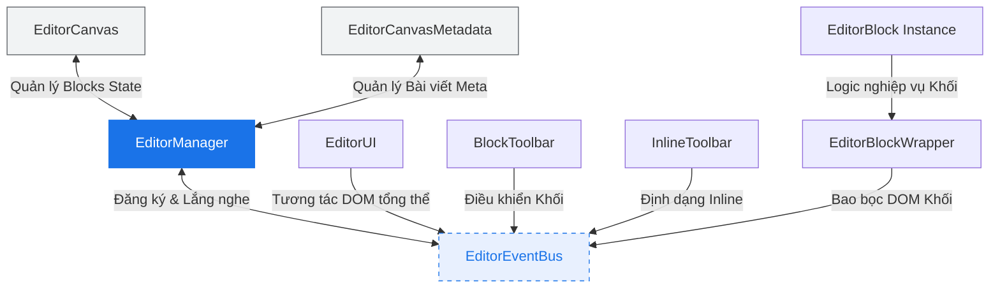
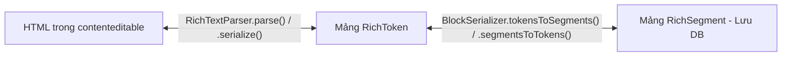

# Tài Liệu Phân Tích Chuyên Sâu: Block Editor Module

Tài liệu này cung cấp cái nhìn chi tiết và toàn diện về mặt kiến trúc kỹ thuật của hệ thống **Block Editor** (Trình soạn thảo khối) tự xây dựng dùng trong CMS của Website Khoa CNTT - Trường Cao đẳng Kỹ thuật Cao Thắng.

---

## 1. Bản Đồ Tổng Quan Kiến Trúc (Architecture & Coordination)

Hệ thống được thiết kế theo hướng **Event-Driven Architecture (EDA)** kết hợp với mô hình **Single Source of Truth (SSOT)**. Sự điều phối trung tâm không tương tác trực tiếp lên DOM mà thông qua một trục truyền tin (`EditorEventBus`).



### 1.1. Bộ Điều Phối Trung Tâm (Central Orchestration)
*   **`EditorEventBus` (`editor.js`)**: Trục xương sống quản lý đăng ký (`subscribe`), hủy đăng ký (`unsubscribe`) và phân phối (`dispatch`) các sự kiện tùy chỉnh (ví dụ: `block:selected`, `block:input`, `inline:format_request`).
*   **`EditorManager` (`editor.js`)**: Đóng vai trò là Mediator khởi tạo toàn bộ hệ thống gồm `EditorCanvas`, `EditorCanvasMetadata`, `EditorUI`, `ContextStore`, `InlineToolbar`, `BlockToolbar`, `EditorListView`. Nó điều hướng luồng dữ liệu từ các sự kiện của Bus xuống Canvas hoặc cập nhật UI.
*   **`EditorCanvas` (`editor.js`)**: Quản lý mảng thực thể `EditorBlock` trong phiên làm việc hiện tại, cung cấp các API thuần thao tác với bộ nhớ như `addBlock`, `updateBlock`, `removeBlock`, và `reorderBlocks`.

---

## 2. Hệ Thống Đăng Ký Khối (Block Registry & Factory Pattern)

Việc mở rộng các khối nội dung được thực thi qua cơ chế **Registry** động thay vì hardcode.

*   **`BlockRegistry` (`block_registry.js`)**: Quản lý một `Map` ánh xạ từ tên định danh khối (ví dụ: `blocks/paragraph`, `blocks/image`) tới cấu trúc Schema định nghĩa và lớp Class tương ứng. Cung cấp API `register` để các khối tự đăng ký khi nạp trang.
*   **`EditorBlock` (`blocks/editor_block.js`)**: Lớp cơ sở trừu tượng (`abstract class`) bắt buộc mọi loại khối phải kế thừa. Nó chuẩn hóa cấu trúc dữ liệu của khối:
    ```javascript
    this.data = {
      rich_text: [], // Dạng Tokenized Text Segment
      meta: {}       // Các thuộc tính riêng của khối (ví dụ: align, anchor_id)
    }
    ```
    Yêu cầu các khối con bắt buộc phải override các hàm:
    *   `render()`: Tạo và trả về Node DOM hiển thị trong Canvas.
    *   `renderInspectorControls()`: Tạo DOM Panel tùy chỉnh thuộc tính ở thanh bên phải.
    *   `serializeData(editableEl)`: Trích xuất dữ liệu từ DOM biểu diễn thành trạng thái có thể tuần tự hóa.

---

## 3. Động Cơ Biểu Diễn & Phân Tích Rich Text (Rich Text Engine)

Điểm sáng nhất của module này là việc từ bỏ cấu trúc HTML thô để chuyển sang mô hình **Tokenized Rich Text** giúp bảo vệ khỏi lỗi bảo mật (XSS) và đồng nhất định dạng dữ liệu lưu trữ.



### 3.1. Các Thực Thể Định Danh Văn Bản (`rich_text_token.js`)
*   **`RichToken`**: Biểu diễn một phân đoạn văn bản trong runtime bộ nhớ của Editor. Chứa `text`, một `Set<string>` lưu các marks (`bold`, `italic`, `underline`, `link`), và `href` tùy chọn. Sử dụng `Set` giúp tối ưu hiệu năng tra cứu mark với độ phức tạp $O(1)$.
*   **`RichSegment`**: Cấu trúc tinh giản được thiết kế riêng để ghi xuống cơ sở dữ liệu dạng JSON. Chuyển đổi Set thành Array để an toàn tuần tự hóa dữ liệu và làm phẳng trường `href` (Flat Schema v2) nhằm tương thích ngược dễ dàng.

### 3.2. Bộ Chuyển Đổi & Phân Tích (`rich_text_parser.js`)
*   **`RichTextParser.parse(html)`**: Nhận HTML thô từ sự kiện Paste hoặc DOM, dựng DOM ảo dạng cô lập (`document.createElement('div')`), duyệt cây DFS (`#walk`) để gom cụm các Text Node đi kèm marks kế thừa từ cha, cuối cùng chạy hàm `mergeAdjacentTokens` để tối ưu hóa gom các token liền kề có cùng định dạng.
*   **`RichTextParser.serialize(tokens)`**: Chuyển đổi mảng token thành mã HTML an toàn. Quá trình này wrap thẻ HTML theo độ ưu tiên chặt chẽ (`SERIALIZE_ORDER` đảo ngược):
    $$\text{underline} \rightarrow \text{italic} \rightarrow \text{bold} \rightarrow \text{link}$$
    Tạo ra cấu trúc chuẩn tắc: `<a><strong><em><u>văn bản</u></em></strong></a>`.

---

## 4. Cơ Chế Biến Đổi & Thao Tác Văn Bản Inline (`inline_formatter_v2.js`)

Khi người dùng bôi đen văn bản và nhấn định dạng (Bold, Link, v.v.), hệ thống thực hiện thuật toán biến đổi cục bộ cực kỳ chính xác.

```
Ví dụ: Áp dụng BOLD trên range [3, 7) của Token [text: "Hello World", marks: []]

Bước 1: Split Token thành 3 phần:
  1. [0, 3)  => "Hel" (Không đổi)
  2. [3, 7)  => "lo W" (Sẽ thêm Bold)
  3. [7, 11) => "orld" (Không đổi)

Bước 2: Thêm mark 'bold' vào phân đoạn giữa.
Bước 3: Gộp các token liền kề nếu trùng khớp định dạng (Merge).
```

*   **Tính toán Offset Thực Tế (`getRangeOffsets`)**: Chuyển đổi đối tượng `Range` của trình duyệt vốn dựa trên Node con phức tạp thành tọa độ ký tự phẳng `[startOffset, endOffset]` tương quan với thẻ cha Editable.
*   **Áp dụng Định Dạng (`applyMark` & `removeLink`)**:
    *   Tách nhỏ các Token hiện tại dọc theo biên `[start, end]`.
    *   Duyệt qua các token nằm trong vùng bôi đen, thêm hoặc xóa mark được yêu cầu.
    *   Tự động dọn dẹp các liên kết rỗng hoặc trùng lặp.

---

## 5. Tuần Tự Hóa & Lưu Trữ Dữ Liệu (Serialization & Serialization API)

*   **`BlockSerializer` (`block_serializer_v2.js`)**:
    *   Cung cấp cơ chế lọc bỏ mã độc và whitelist hóa các thuộc tính được chấp nhận qua `ALLOWED_MARKS` (`bold`, `italic`, `underline`, `link`).
    *   Sanitize triệt để liên kết qua RegExp `SAFE_HREF` (chỉ cho phép http, https, mailto, hoặc relative URL), vô hiệu hóa mọi hành vi tấn công `javascript:` injection.
    *   Đóng gói toàn bộ cấu trúc bài viết thành JSON Payload hoàn chỉnh thông qua phương thức `toPayload()` kết nối dữ liệu cấu trúc của khối cùng thẻ metadata tương quan.

---

## 6. Tổng Kết Ưu Điểm Thiết Kế

1.  **Tính Độc Lập Thiết Bị (Bijective Round-Trip)**: Trạng thái soạn thảo từ DB (`RichSegment[]`) dựng lên DOM chỉnh sửa và ngược lại đều bảo toàn cấu trúc dữ liệu tuyệt đối nhờ cơ chế Tokenizer khép kín.
2.  **Khả Năng Mở Rộng Cực Cao**: Để thêm một block mới, lập trình viên chỉ cần đăng ký Schema và Class tương ứng vào `BlockRegistry` mà không cần sửa đổi bất kỳ mã nguồn lõi nào trong `EditorManager`.
3.  **Tách Biệt Trách Nhiệm (Separation of Concerns)**: Trạng thái lưu trữ (Model) được quản lý tập trung ở `EditorCanvas`, trong khi giao diện hiển thị (View) và thao tác người dùng (Controller) liên lạc bất đồng bộ thông qua Event Bus bảo đảm tính loose coupling bền vững.
